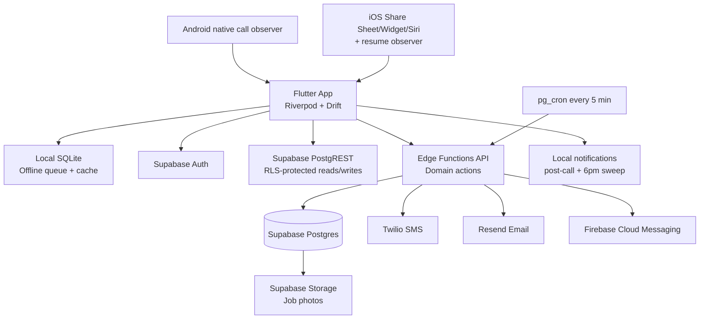
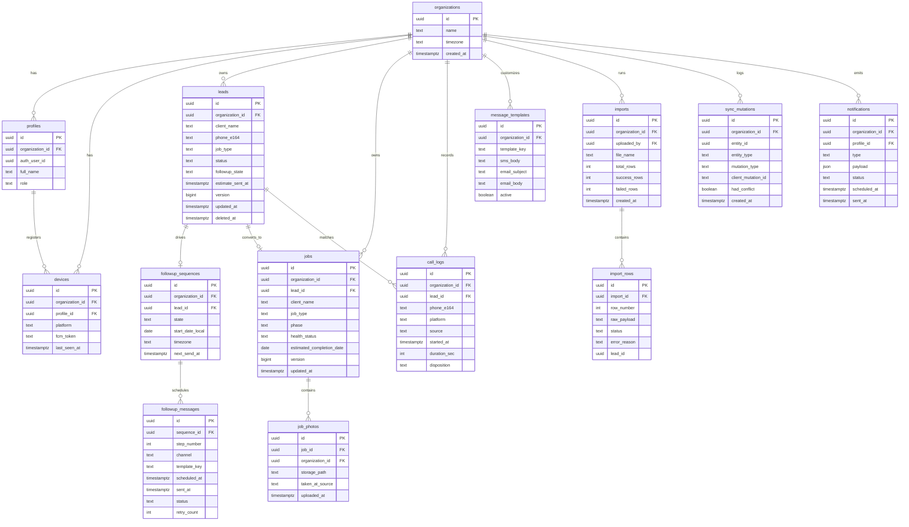

# Phase 0 Context - Architecture & Setup

## Phase Boundary

Phase 0 decides foundation only: stack, schema, contracts, auth, offline strategy, scheduling, notification architecture, cost model, and team collaboration mechanics. It does not add new end-user features beyond scaffold-level parity setup.

## Non-Negotiable Product Constraints

- Target user: non-technical contractors in-field, low cognitive load, one-handed use
- UX reference: existing React prototype in this repository
- Offline lead capture is mandatory
- SMS is mandatory for follow-up automation
- Infrastructure budget target: $50-100/month
- Two contributors share one repo and must avoid file-collision work

## System Architecture



## Decision Matrix

| Decision | Choice | Why This Over Alternatives | Tradeoff | MVP Cost (50 users) | What Changes >50 Users |
|---|---|---|---|---|---|
| Backend | Supabase (managed) | Includes Postgres, auth, storage, edge functions, RLS in one service; lowest ops load for 2 people vs Railway/Fly custom API | Some vendor coupling to Supabase auth/functions | Pro plan $25/month baseline | Add staging + prod projects and queue observability; consider dedicated worker queue around 300+ users |
| Database | Supabase Postgres | Relational data fits leads/jobs/followups/calls better than Firestore; lower model complexity than PlanetScale + separate auth/storage | Need migration discipline and SQL ownership | Included in Supabase plan | Add read replicas/caching and stricter partitioning/index tuning |
| Authentication | Supabase Auth (email+password + magic link) | Avoid OTP SMS auth cost and A2P setup complexity while preserving mobile usability | Slightly less "phone-native" sign-in than OTP | Included in Supabase | Add optional phone OTP/passkeys once auth volume/support demand grows |
| SMS | Twilio Programmable Messaging | Most mature API/ecosystem for contractor/client SMS workflows | Carrier fees and A2P compliance overhead | ~ $1.66 for 200 SMS + number/campaign fees | Cost scales linearly; add delivery analytics and template throttling |
| Email | Resend | Simple API and generous free tier for MVP volumes | Less enterprise tooling than SendGrid | $0 on free tier for low volume | Move to paid tier (~$20+) if monthly volume exceeds free limits |
| File Storage | Supabase Storage | Same auth model and RLS policies as app data; avoids extra vendor complexity | Slightly less globally optimized than R2 for very large media workloads | Included at MVP usage | Migrate hot/cold photo tiers or CDN strategy if asset volume increases significantly |
| Push Notifications | Firebase Cloud Messaging | Unified push transport for Android and iOS from one backend integration | Requires APNs setup for iOS bridge | $0 | Add notification preference matrix and delivery monitoring |
| Custom API hosting | Supabase Edge Functions | Co-located with Postgres + secrets + cron triggers | Deno runtime constraints for heavy workloads | Included | Move long-running jobs to queue workers if throughput grows |
| Local DB | Drift + SQLite | Deterministic offline queue control and strong typed Dart models | Sync engine is custom logic to maintain | App-only dev cost | Add background sync optimization and selective replication |

## Alternatives Evaluated (Summary)

| Option | Verdict | Reason |
|---|---|---|
| Firebase (backend+db+auth) | Rejected for MVP | Excellent managed platform, but Firestore document model adds complexity for relational pipeline/join-heavy reporting and cost predictability |
| Railway + custom API | Rejected for MVP | Lower infra lock-in but significantly higher architecture + operations burden for 2-person team |
| Fly.io + custom API | Rejected for MVP | Powerful and flexible, but requires infra tuning and observability setup beyond MVP team bandwidth |
| PlanetScale (database) | Rejected for MVP | Strong MySQL platform but adds extra service and auth/storage integration overhead, and base pricing is higher than needed for MVP |

## Data Model

### Core Tables

- `organizations`: Contractor business workspace/tenant boundary
- `profiles`: App user profile linked to Supabase `auth.users`
- `devices`: Registered mobile devices + FCM tokens
- `leads`: Pipeline records and follow-up trigger states
- `followup_sequences`: Sequence state per lead (active/paused/stopped/completed)
- `followup_messages`: Per-step queue entries (day 2/5/10, sms/email)
- `jobs`: Active projects linked from won leads or created manually
- `job_photos`: Timestamped photo metadata + storage path
- `call_logs`: Unknown/known call capture events for daily sweep and post-call flows
- `message_templates`: Contractor-customizable follow-up templates
- `imports`: CSV import batches
- `import_rows`: Parsed import row status/error records
- `sync_mutations`: Idempotency and sync conflict audit log
- `notifications`: Push/in-app notification events

### Mermaid ER Diagram



### Indexing Strategy (Initial)

- `leads`: `(organization_id, status, updated_at desc)`, unique `(organization_id, phone_e164)` partial where `deleted_at is null`
- `jobs`: `(organization_id, phase, health_status)`, `(organization_id, updated_at desc)`
- `followup_messages`: `(status, scheduled_at)`, `(sequence_id, step_number)` unique
- `call_logs`: `(organization_id, disposition, started_at desc)`, `(organization_id, phone_e164)`
- `sync_mutations`: unique `(organization_id, client_mutation_id)` for idempotency

## API Contract Strategy

### Contract Style

- Primary data access: Supabase SDK (PostgREST) against RLS-protected tables/views
- Business-critical actions: Edge Function REST endpoints (`/functions/v1/*`)
- Rationale: reduce custom CRUD boilerplate while forcing server-authoritative domain transitions

### App-Facing Endpoints

| Endpoint | Method | Purpose | Auth |
|---|---|---|---|
| `/functions/v1/leads/estimate-sent` | POST | Mark estimate sent and create follow-up sequence | Required |
| `/functions/v1/leads/mark-won` | POST | Mark lead won and optionally create prefilled job shell | Required |
| `/functions/v1/leads/mark-cold` | POST | Mark lead cold and cancel pending follow-up | Required |
| `/functions/v1/leads/followup/pause` | POST | Pause active sequence | Required |
| `/functions/v1/leads/followup/stop` | POST | Stop sequence permanently | Required |
| `/functions/v1/estimate/send` | POST | Send quick estimate SMS and trigger sequence | Required |
| `/functions/v1/jobs/advance-phase` | POST | Advance job phase with guardrails | Required |
| `/functions/v1/photos/signed-upload-url` | POST | Return short-lived upload URL for job photo | Required |
| `/functions/v1/import/parse-csv` | POST | Parse CSV and return mapping preview | Required |
| `/functions/v1/import/commit` | POST | Persist mapped rows into leads/jobs | Required |
| `/functions/v1/calls/report` | POST | Persist call event from native bridge or fallback action | Required |
| `/functions/v1/daily-sweep/review` | POST | Save/skip unknown calls in bulk | Required |
| `/functions/v1/sync/push` | POST | Push offline mutations batch with idempotency keys | Required |
| `/functions/v1/sync/pull` | GET | Pull server changes since cursor timestamp | Required |
| `/functions/v1/dashboard/home` | GET | Aggregated home metrics/reminders | Required |

### Example: Offline Sync Contracts

`POST /functions/v1/sync/push`

```json
{
  "device_id": "uuid",
  "cursor": "2026-02-26T17:10:00Z",
  "mutations": [
    {
      "client_mutation_id": "uuid",
      "entity": "lead",
      "entity_id": "uuid",
      "type": "upsert",
      "base_version": 4,
      "payload": {
        "status": "estimate_sent",
        "estimate_sent_at": "2026-02-26T17:05:00Z"
      }
    }
  ]
}
```

`200 OK`

```json
{
  "applied": ["uuid"],
  "conflicts": [
    {
      "client_mutation_id": "uuid",
      "server_entity_version": 6,
      "resolution": "server_wins_terminal_status"
    }
  ],
  "new_cursor": "2026-02-26T17:11:10Z"
}
```

## Authentication Flow

### Chosen Flow

- Primary: email + password
- Fallback: magic link email sign-in
- On first login: collect business name, contractor name, phone, timezone

### Why

- No auth-SMS dependency keeps recurring costs lower
- Avoids OTP deliverability and registration complexity during MVP
- Works well with Supabase-native session lifecycle

### Tradeoffs

- Not as frictionless as phone OTP for some users
- Requires password recovery UX and secure password handling

### Scale Changes

- At higher adoption, add optional phone OTP and/or passkeys
- Add org invites/roles beyond owner-first model

## Offline Sync Strategy

### Sync Model

- Drift local DB is source-of-truth while offline
- Every mutation is queued in local outbox with `client_mutation_id`
- Sync trigger: connectivity regain, app foreground, manual pull-to-refresh
- Order: `push local mutations -> pull server deltas`

### Conflict Policy

- Server remains canonical
- Terminal lead statuses (`won`, `cold`) never regress
- Follow-up state precedence: `stopped > paused > active`
- Non-terminal fields resolve by latest server timestamp (LWW)
- All conflicts logged in `sync_mutations.had_conflict = true`

### Idempotency

- Unique `(organization_id, client_mutation_id)` ensures replay-safe retries
- Duplicate push returns previously applied result instead of re-applying mutation

## Notification System

### Channels

- **Local notifications (device-generated):**
  - Android post-call capture prompt
  - iOS fallback prompts (resume/share-sheet follow-through)
  - Daily sweep reminder at 6 PM local device time

- **Push notifications (server-generated via FCM):**
  - Follow-up sent confirmation/failure alerts
  - "Won lead without project" reminders
  - Import completion results for longer operations

### Delivery Rules

- Store one active FCM token per device record
- Respect user notification preferences stored in profile/settings
- Fallback to in-app inbox when push permission denied

## Follow-Up Scheduler Design

### Sequence Creation

When estimate is marked sent:
1. Create `followup_sequences` row
2. Create 3 `followup_messages` rows for day offsets 2/5/10
3. Compute each `scheduled_at` in contractor timezone
4. Clamp times into 9 AM-6 PM send window

### Dispatch Engine

- `pg_cron` runs every 5 minutes
- Invokes `dispatch-followups` Edge Function
- Function selects `status = queued AND scheduled_at <= now()` messages
- Sends via Twilio/Resend with idempotency key = message id
- Updates status to `sent` or `failed`
- Retries failed sends with exponential backoff up to 3 attempts

### Pause/Stop Semantics

- `pause`: keep unsent rows but skip dispatch while sequence state = paused
- `stop`: set sequence stopped and mark unsent rows canceled

## Cost Estimate (MVP: 50 users, 500 leads/month, 200 SMS/month, 100 photos/month)

| Component | Estimate |
|---|---|
| Supabase Pro | $25/month baseline |
| Twilio SMS sends | ~ $1.66/month for 200 outbound SMS at $0.0083 each (carrier fees extra) |
| Twilio number + A2P recurring fees | Roughly $3-6/month depending on number/campaign choices |
| Email (Resend) | $0 on free tier at MVP volume |
| Storage (photos) | Included at MVP volume in Supabase Pro allowances |
| FCM push | $0 |
| Apple Developer Program | $99/year (~$8.25/month equivalent) |
| Google Play Console | $25 one-time (non-recurring) |

**Expected recurring monthly range:** about **$38-$45/month** pre-growth, with headroom under the $50-100 target.

## Pricing References Used

- Supabase pricing: https://supabase.com/pricing
- Supabase usage quotas: https://supabase.com/docs/guides/platform/manage-your-usage
- Firebase pricing: https://firebase.google.com/pricing
- Firestore pricing details: https://cloud.google.com/firestore/pricing
- Railway pricing: https://railway.com/pricing
- Fly.io pricing: https://fly.io/pricing
- PlanetScale pricing: https://planetscale.com/pricing
- Twilio SMS pricing (US): https://www.twilio.com/en-us/sms/pricing/us
- Twilio phone number pricing (US): https://www.twilio.com/en-us/phone-numbers/pricing/us
- Twilio A2P 10DLC fee changes: https://www.twilio.com/docs/messaging/compliance/a2p-10dlc/price-increases-for-twilio-customers
- Resend pricing: https://resend.com/pricing
- Cloudflare R2 pricing: https://developers.cloudflare.com/r2/pricing/
- Google Play Console fee: https://support.google.com/googleplay/android-developer/answer/6112435
- Apple Developer Program memberships: https://developer.apple.com/support/compare-memberships/
- Firebase Cloud Messaging docs: https://firebase.google.com/docs/cloud-messaging

## Git Branching and Parallel Rules

- Branch format: `feature/{phase}-{task}-{short-description}`
- Examples:
  - `feature/0-3-flutter-scaffold`
  - `feature/2-2-lead-capture-ui`
  - `feature/3-1-followup-scheduler`
- PR rules:
  - Required: at least one reviewer from other co-founder
  - Squash merge into `main`
  - CI checks must pass before merge
- Parallelization:
  - `Michael` owns Flutter UI screen files
  - `Fabricio` owns backend, native bridges, schema, sync engine
  - Shared files (`app_router.dart`, shared models, theme tokens) require sequential handoff

## Flutter Scaffold Direction

- State management: Riverpod (`flutter_riverpod`)
- Navigation: `go_router`
- Data: `drift` + `supabase_flutter`
- Messaging/notifications: Twilio through backend, `firebase_messaging`, `flutter_local_notifications`
- Theme: dark premium token mapping from React (`#161618` background, `#F5F5F7` foreground, `#007AFF` primary, glass surfaces)

## Deferred Ideas (Out of Current Phase)

- Invoicing and payments
- Crew scheduling board
- Desktop admin dashboard
- Third-party integrations (QuickBooks/Jobber)

---
*Created: 2026-02-26 during `/gsd:discuss-phase 0`*
